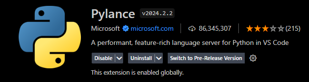

# WEB Test Automation Project - Hanzo

This test automation project was developed to validate the website https://practice.automationtesting.in/. Uses Robotframework with Python and SeleniumWebdriver.

# Project structure


### .github/workflows

- Contains the execution files for GitHub pipeline.

### components

- Contains the test files, by components, to be executed.

###helpers

- Contains configuration files and custom keywords.

### keywords

- Keywords referring to components.

### libraries

- Custom libraries in Python.

### pages

- Page Objects referring to components.

###results

- Result of automated tests.

# Environment Setting

### Installing the latest Java

1. Download the JDK for your platform from [Oracle JDK](https://www.oracle.com/java/technologies/javase-jdk11-downloads.html) or an OpenJDK version of your choice.
2. Install the JDK following the instructions specific to your operating system.
3. Set the `JAVA_HOME` environment variable to point to the directory where the JDK was installed.
4. Add the JDK executable path to the system `PATH`.

### Python Installation

For correct installation of the libraries, _Python_ must be previously installed. Go to [www.python.org/downloads](https://www.python.org/downloads/) and follow the instructions below:

1. Click on the `Download Python 3.10.5` option or the most current version available when accessing the page.

2. Select the `Add Python 3.10 to PATH` option and click `Install Now`.

3. Wait for the installation.

4. Installation complete, click `Close`.

### Installation Robot Libraries Installer

This program aims to assist in installing the libraries necessary for the correct use of the _Robot Framework_ with _Visual Studio Code_.

Download the file [RobotLibrariesInstaller.bat](https://drive.google.com/file/d/1hDVbP7QXGrfOSxW8JUXmyRBSTf6HWnn7/view?usp=sharing) and follow the instructions below:

1. Access the link above and click on the `Download` option.

2. Save the file to your desktop.

3. Right-click on the file icon in question and select `Run as administrator`.

4. Type `1` and click `Enter` on your keyboard.


5. Wait for the installation. Afterwards, press any key to exit the installer.

### Visual Studio Code Installation

1. Download Visual Studio Code from [VSCode](https://code.visualstudio.com/download).

### Installation Visual Studio Code Extensions

Open your VSCode and install the following extensions:

1. Pylance.



2.Python.


3. Python Debugger.


4. Robot Framework Language Server.


# Cloning the project

1. Clone the [project](https://github.com/hyggedigitaltecnologia/web-tests-hanzo.git) repository.

2. Open the project in your VSCode.

3. Open a terminal in the project root and do the following downloads.

### Installing Node

1. Download NodeJs from [Node](https://nodejs.org/en/download).

### Installing Allure

1. Download Allure by running:

```bash
npm install --save-dev allure-commandline

npx allure-commandline serves
```

2. Close and open your terminal.

# How to run

1. Open a terminal in the project root.

2. Enter the command:

```bash
1. Running the tests:

robot --variable COMPONENT:my_account/tests/my_account_tests.robot --variable TAG:successful_registration --variable BROWSER:chrome controller.robot
```

# Generating Allure Report

1. Run the following commands:

```bash
1. allure generate --clean ./output/allure -o allure-report/

2. allure open
```


<!-- # Executando no GitHub Actions

Acesse as [actions](https://github.com/hyggedigitaltecnologia/web_tests_agibank/actions) e siga os passos:

1. Clique em "Manual Run WEB Tests".


2. Clique em "Run workflow".


3. Preencha os campos de tal forma que:

```bash
Qual é o COMPONENTE a ser executado?

-> pesquisa/tests/pesquisa_tests.robot

Qual é a TAG a ser executada?

-> test

Qual é o BROWSER a ser executado?

-> chrome
```


4. Clique em "Run worflow".


5. Aguarde a execução.


6. Acesse o run.


7. Tenha acesso ao relatório para download e os dados de execução.


# Execução do Projeto

https://github.com/hyggedigitaltecnologia/web_tests_agibank/assets/104523199/5d7d75b4-e051-45ea-9e99-ddee43132114 -->
